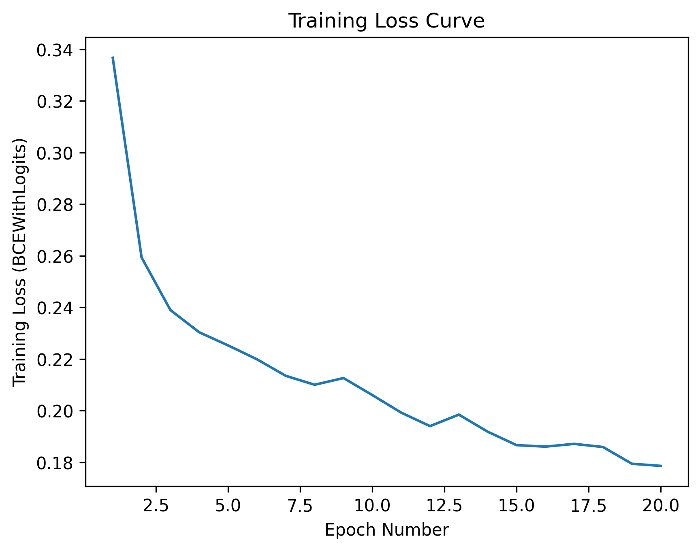
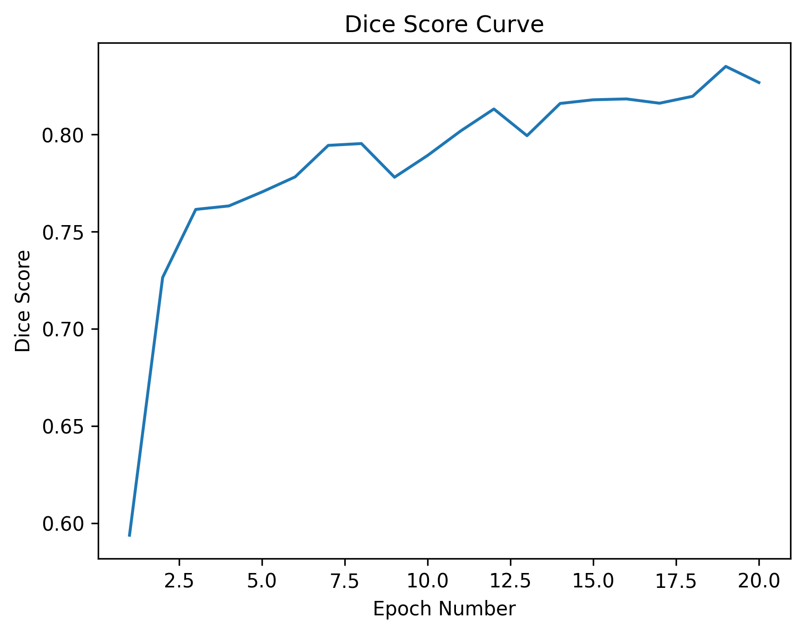
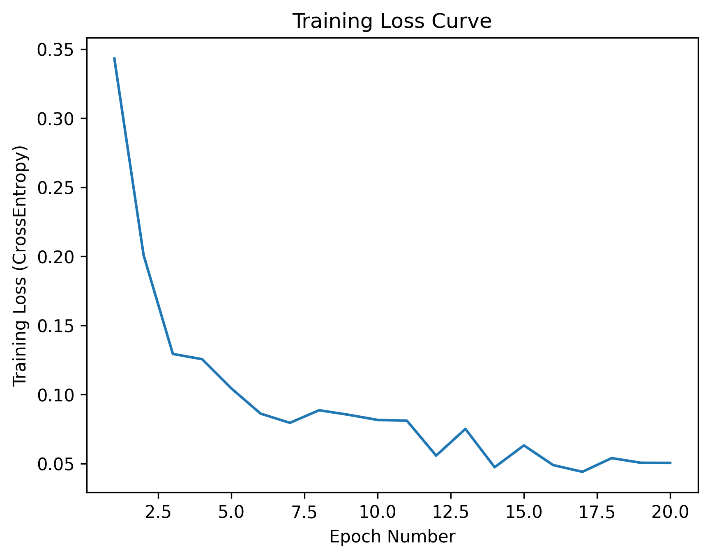
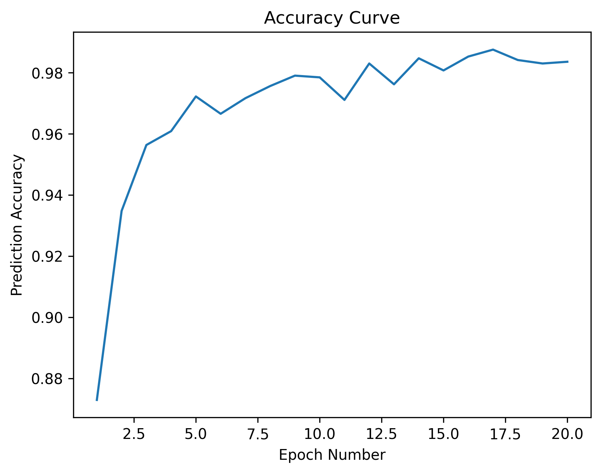
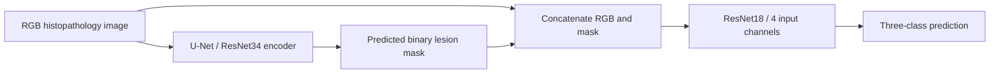

# Supervised Computer Vision for Gastric Cancer Histopathology

A supervised learning internship project combining **U-Net lesion segmentation** with **mask-guided ResNet18 classification** of gastric histopathology images.

**[Training results](results/README.md) · [Model weights](https://github.com/LingQingyang/Supervised-Computer-Vision-for-Gastric-Cancer-Histopathology/releases/tag/archived-training-results-v1) · [Segmentation code](gastric_cancer_u_net_train.py) · [Classification code](gastric_cancer_resnet_train.py) · [Inference code](gastric_cancer_main.py)**

## Results at a glance

The recovered experiment archive contains four training curves spanning **20 epochs** and the two saved model checkpoints. The original figures are displayed below without modification.

| Stage | Observed training trend | Approximate final value read from the figure |
| --- | --- | --- |
| U-Net segmentation | BCE loss decreases; Dice generally increases | Loss ≈ 0.18; Dice ≈ 0.83 |
| ResNet18 classification | Cross-entropy decreases; accuracy generally increases | Loss ≈ 0.05; accuracy ≈ 98% |

**These are training metrics.** The archive contains no raw epoch logs or held-out evaluation report, so the values above are approximate visual readings, not exact measurements or test performance. The committed scripts default to five epochs; the archive documents a longer run whose complete configuration was not supplied.

| U-Net training loss | U-Net training Dice |
| --- | --- |
|  |  |

| ResNet18 training loss | ResNet18 training accuracy |
| --- | --- |
|  |  |

See the [results guide](results/README.md) for the metric definitions, original file inventory, checkpoint downloads, and checksums.

## Pipeline



The segmentation stage provides spatial information to the classifier. During **classifier training**, the fourth channel is the dataset's **annotated mask**. During **inference**, it is the **predicted U-Net mask**. This distinction matters when interpreting the classifier's training accuracy: it does not measure the performance of the complete predicted-mask pipeline on unseen images.

## Models and implementation

| Component | Implementation |
| --- | --- |
| Segmentation | `segmentation-models-pytorch` U-Net; ResNet34 encoder initialized with ImageNet weights; 3 input channels; 1 output channel |
| Segmentation objective | `BCEWithLogitsLoss`; sigmoid and a 0.5 threshold for Dice calculation |
| Classification | ImageNet-initialized ResNet18 backbone; input convolution replaced with a 4-channel convolution; output layer replaced with a 3-class layer |
| Classification objective | `CrossEntropyLoss`; argmax prediction for accuracy |
| Training defaults in source | Adam, learning rate `1e-4`, batch size `4`, `5` epochs per stage |
| Image preparation | RGB conversion; 512 × 512 tensors; ImageNet RGB normalization |
| Mask preparation | Grayscale conversion; nearest-neighbour resizing; thresholding to binary values |
| Training augmentation | Synchronized horizontal/vertical flips and rotations in multiples of 90 degrees |

The replaced input convolution and classification head are newly initialized layers. The inference script uses the display labels `Normal`, `CancerType1`, and `CancerType2`; verify their correspondence with the dataset's integer labels before interpreting predictions. The archive does not supply clinical subtype definitions.

## Repository layout

```text
.
├── README.md
├── gastric_cancer_u_net_train.py       # Original segmentation training export
├── gastric_cancer_resnet_train.py      # Original classification training export
├── gastric_cancer_main.py              # Original inference/visualisation export
└── results/
    ├── README.md                      # Results, interpretation, and downloads
    ├── SHA256SUMS.txt                 # Checksums of all six recovered files
    └── figures/
        ├── unet_training_loss_curve.png
        ├── unet_dice_score_curve.png
        ├── resnet_training_loss_curve.png
        └── resnet_accuracy_curve.png
```

`U_Net.pth` and `ResNet.pth` are available as **[Release assets](https://github.com/LingQingyang/Supervised-Computer-Vision-for-Gastric-Cancer-Histopathology/releases/tag/archived-training-results-v1)**. Keeping the large checkpoints outside Git history makes the code and results gallery easier to clone. All six recovered files retain their original contents.

## Running the original workflow

The three Python files are **Google Colab notebook exports**, preserved unchanged. They contain `drive.mount`, hardcoded Drive paths, and notebook shell commands beginning with `!`; they require adaptation before execution as ordinary `.py` programs.

### 1. Prepare the environment and data

The original running guide lists Python 3.9+, PyTorch 1.13.1 with CUDA 11.6, torchvision 0.14.1, and `segmentation-models-pytorch` 0.3.3 as its reference environment. It also lists NumPy, pandas, Pillow, Matplotlib, and tqdm. This historical environment has not been rerun or independently validated in this results update.

Prepare an RGB image directory, a matching mask directory, and a CSV with the columns `image_name` and `label`. Image and mask filenames must match. The scripts filter out rows for which either file is missing; check the reported sample count. The dataset is not included in this repository.

The original training paths are:

```text
/content/drive/MyDrive/Trivial Files/train_org_image_100
/content/drive/MyDrive/Trivial Files/train_mask_100
/content/drive/MyDrive/Trivial Files/train_label.csv
```

### 2. Train or download the checkpoints

For training, use the segmentation export first, followed by the classifier export. When using Colab, paste/import the exported code into notebook cells so that the `!pip` and `!cp` commands are handled as notebook commands. Update the Drive paths and epoch count for your experiment.

For inference with the archived models, download both checkpoints from the [Release](https://github.com/LingQingyang/Supervised-Computer-Vision-for-Gastric-Cancer-Histopathology/releases/tag/archived-training-results-v1) and place them where the inference script expects them:

```text
/content/drive/MyDrive/AI_Models/U_Net.pth
/content/drive/MyDrive/AI_Models/ResNet.pth
```

Check the files against [SHA256SUMS.txt](results/SHA256SUMS.txt). For local execution, remove the Drive mounting code, replace notebook shell commands with terminal commands, and update the dataset and checkpoint paths. The checkpoints contain CUDA storage references; use `map_location=device` when loading on a different device, especially a CPU.

### 3. Run single-image inference

In `gastric_cancer_main.py`, set `test_image_path` to an **individual image file**. The current default names a directory, but the function calls `Image.open` and accepts one image at a time. The workflow produces a binary mask, three class probabilities, and a three-panel visualisation.

Training resizes and square-pads images, whereas the original inference transform directly resizes to a square. Align these transforms before undertaking a reproducibility or generalisation study.

## Scope and next steps

This repository documents a supervised computer vision prototype and its recovered training artefacts. This update does not rerun training or inference. The supplied archive contains no validation/test curves, confusion matrix, inference examples, or evidence of improvement over an RGB-only baseline.

Useful extensions are a documented patient-aware data split, held-out evaluation of the full pipeline, an RGB-only comparison, classifier training with predicted masks, consistent preprocessing, and reproducible configuration and logs.

## 中文简介

这是一个胃癌病理影像实习项目：使用 U-Net 进行病灶分割，再将 RGB 图像与 mask 拼接为四通道输入，通过 ResNet18 完成三分类。分类器训练时使用标注 mask，推理时使用 U-Net 预测的 mask。

本次补充了找回的 **4 张训练曲线和 2 个模型权重文件**。曲线直接展示于本页，权重可从 [Release](https://github.com/LingQingyang/Supervised-Computer-Vision-for-Gastric-Cancer-Histopathology/releases/tag/archived-training-results-v1) 下载，原有三个代码文件保持不变。图中记录了 20 个 epoch，现有代码默认配置为 5 个 epoch；具体实验配置与原始数值日志未包含在压缩包中。上述 Dice 和准确率属于训练指标，不能作为测试集或完整推理流程的评估结果。
